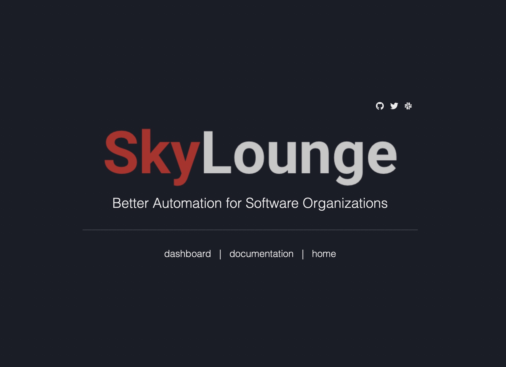

# SkyLounge Hello World

This sample repository uses a [SkyLounge blueprint]() to build, test, and deploy the single-page website:



via an `nginx` web server in a [Google Cloud](https://cloud.google.com) project.

## Overview

This repository contains the source for this static web page, a [`SkyLounge Job`]() for simple integration testing, and a partially-complete [`skylounge.yml`]() to configure **SkyLounge** to automate a *development* environment and a *production* environment using the [cloud-run-web-app](sky-lounge/skylounge-definitions/blueprints/cloud-run-web-app/blueprint.yml) blueprint. The blueprint provisions the following using your [Google Cloud Account](https://console.cloud.google.com/freetrial/signup/tos):
* [Google Cloud Run](https://cloud.google.com/run?hl=en) instances running `nginx` web servers of the web page
* [Google Cloud Load Balancing](https://cloud.google.com/load-balancing?hl=en) for routing internet traffic to Cloud Run
* [Google Cloud DNS](https://cloud.google.com/dns?hl=en) record sets of custom domains for the development and production environments

Following the instructions below, you will:
1. [Initialize](#initial-set-up) this project
2. [Set up SkyLounge](#set-up-skylounge) SkyLounge to access your fork and run the automated lifecycle
3. [Adapt](#complete-the-skyloungeyml) the `skylounge.yml` file

Let's go!

## 1. Initial Set-up

We first set up the Google Cloud services that the blueprint will leverage.

0. If you don't have one already, create a [Google Cloud Account](https://console.cloud.google.com/freetrial/signup/tos).
1. Create a [Google Project](https://cloud.google.com/resource-manager/docs/creating-managing-projects) with your choice of `Project_ID`. For instance, this might be `skylounge-hello-world`.
2. Choose a [Google Cloud Region](https://cloud.google.com/compute/docs/regions-zones?hl=en) for this project. For instance, this might be `us-central1`.
3. Set up a [Google Storage Bucket](https://cloud.google.com/dns?hl=en) to hold the **Terraform** state of your environments.
3. Set up a [Google Cloud Artifact Repository](https://cloud.google.com/artifact-registry?hl=en) to hold a container image in Docker format, noting the full `Repository_URL`. For instance, this might be `us-west1-docker.pkg.dev`.

Now we set up GitHub.

5. Fork this repository in your own GitHub organization.
6. Store your Google Cloud credentials in the forked repository with the name `GOOGLE_CREDENTIALS` as a [GitHub secret](https://docs.github.com/en/actions/security-guides/encrypted-secrets). **TBD: Is that enough to enable SkyLounge use? What can be done to restrict to SkyLounge?**

## 2. Set Up SkyLounge


7. Install the `SkyLounge App` for the forked repository by following the instructions at [Install SkyLounge](https://scribehow.com/shared/Installing_SkyLounge_in_GitHub__D7Ue1BoaS36c8sqW9oMjNQ). At step 5, include this forked repository among those for which SkyLounge is authorized.
8. At the SkyLounge Dashboard, **TBD: walk through or point to documentation on authorizing & downloading the skylounge.yml**

## Adapt the `skylounge.yml`

We now adapt the downloaded `skylounge.yml`. To speed things up, we have included a partially complete file in [partial_skylounge.yml](partial_skylounge.yml) which you can copy or follow along in. We focus here on the specific elements you need to provide. For more on the syntax and elements of a `skylounge.yml`, please see [`skylounge.yml` documentation]().

9. In the "development" workflow, job "build", step "build-container-image", set the `template-uri` to "sky-lounge/skylounge-definitions/step-templates/pack/nginx/build-steps.yml"

```yaml
...
workflows:
  - workflow: development
    jobs:
      - job: build
        steps:
          - step: build-container-image
            template-uri: sky-lounge/skylounge-definitions/step-templates/pack/nginx/build-steps.yml
...
```

10. In the "development" workflow's job "load-balancer", you provide four parameters:
  * for `dns_zone_name` create name for the DNS zone in Google DNS in which to register the *development* application route
  * set the `gcp_project_id` to the *Google Cloud Project ID* you set up in step 1 above
  * set the `gcp_region` to the *Google Cloud Region* you set up in step 2 above
  * set the `tf_state_bucket` to the *Google Cloud Storage Bucket* you set up in step 3 above

11. In the "development" workflow's job "integration-test", set the `template-uri` to "sky-lounge/skylounge-hello-world/skylounge/jobs/integration-test.yml":
```yaml
...
      - job: integration-test
        template-uri: sky-lounge/skylounge-hello-world/skylounge/jobs/integration-test.yml
...
```

12. In the "development" workflow, you set two parameters:
  * for `app_route` create the route for your application in the *development* environment.
  * set `build_paths` to a list of globs specifying the file paths, which here will be "["public/**", "nginx.conf"]":
```yaml
...
    params:
      app_route: # The route to use for the application in development.
      build_paths: ["public/**", "nginx.conf"]
...
```

13. In the "production" workflow's only job, "load-balancer", you again set four parameters. Only the `dns_zone_name` need be different; the others can be the same as in step 10. above.

14. In the "production" workflow's `params`, you specify a different `app_route` for the website in *production*:
```yaml
...
    params:
      app_route: # The route to use for the application in production.
...
```

15. Finally, you set the only global `params` for all workflows, setting the `registry_full_url` to the Google Cloud Artifact Repository you created in step 4. above.
